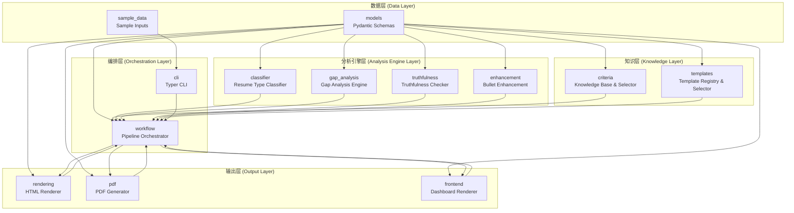
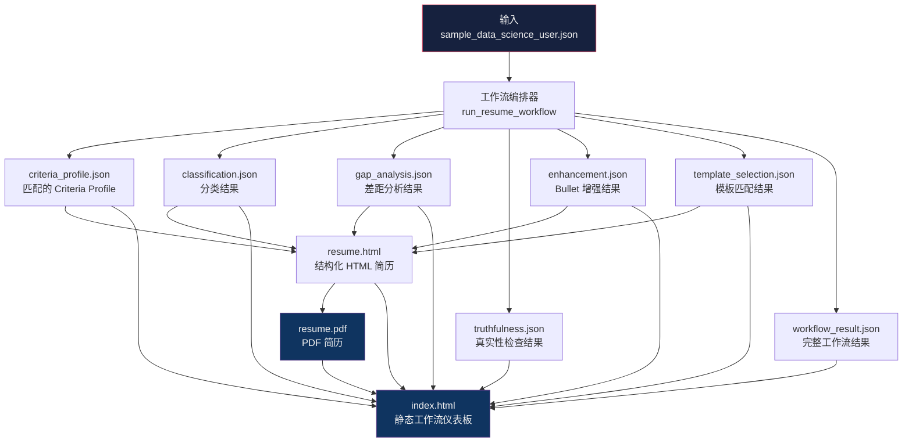

# 架构与流程图 (Architecture Diagram v0)

> 中文优先 | Chinese-first

本文档使用 Mermaid 图表展示 `resume_pdf_agent` 的系统架构和工作流。

## A. 高层工作流管线 (High-Level Pipeline)

## B. 模块依赖图 (Module Dependency)

## C. 产物流转图 (Artifact Flow)

## 数据流总结

1. **输入**：包含用户画像（`UserProfile`）和简历内容（`ResumeContent`）的 JSON 文件
2. **中间产物**：各阶段生成的 JSON 文件，记录分析结果和决策依据
3. **最终输出**：
   - `resume.html` — 可直接在浏览器查看的 ATS 友好简历
   - `resume.pdf` — 从 HTML 生成的 PDF
   - `index.html` — 工作流执行仪表板

## 技术栈

| 层级 | 技术 |
|------|------|
| 数据模型 | Pydantic v2 |
| 模板引擎 | Jinja2 |
| CLI 框架 | Typer |
| PDF 生成 | WeasyPrint（可选）/ Mock Backend |
| 测试框架 | pytest |
| 图表 | Mermaid（本文档） |

## 安全声明

- 不调用 LLM API（GPT-4、Claude、Gemini 等）
- 不联网搜索或获取外部数据
- 不声称知道任何公司的内部筛选标准
- 不预测录用概率
- 所有分析基于用户提供的确定性数据

---

*详见 `docs/limitations_and_roadmap_v0.md` 了解当前限制和未来路线图。*
